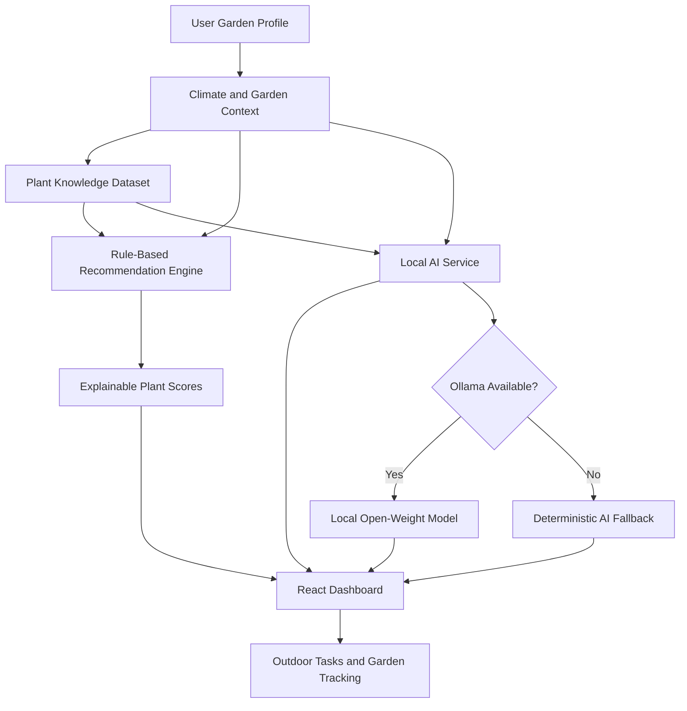

# 🌱 Local Micro-Climate Garden Planner

**Grow Smarter. Start Where You Are.**  
*Hacktoberfest Open-Source AI Challenge 2026 — Week 1: Touch Grass*

A local-first, AI-powered gardening assistant that helps people discover suitable plants for their micro-climate, plan their gardens, track plant growth, and spend more time outdoors.

---

## 🌿 Overview

**Local Micro-Climate Garden Planner** is a full-stack web application designed to make home gardening smarter, simpler, and more accessible.

Every garden has different growing conditions. A sunny terrace, a shaded balcony, and a small backyard may require different plants and care routines—even when they are in the same city.

This application considers a gardener's location, growing space, sunlight exposure, soil type, water availability, temperature, and gardening experience to generate personalized plant recommendations.

It combines a transparent, rule-based recommendation engine with a locally running open-weight language model to provide contextual gardening guidance without depending on a paid cloud AI API.

Most importantly, the application encourages users to turn digital recommendations into real-world activities: observing sunlight, checking soil moisture, planting seeds, and tracking plant growth.

---

## 🎯 Problem Statement

Beginner gardeners often struggle to determine:
- Which plants are suitable for their available space and local conditions.
- How much sunlight and water their plants need.
- When and how to start planting.
- How to respond to heat, cold, wind, and heavy rainfall.
- How to maintain a consistent gardening routine.

Generic gardening advice may overlook the differences between individual growing environments.

**Our solution**: provide explainable, personalized gardening recommendations and a practical outdoor action plan based on the user's garden profile and available climate information.

---

## ✨ Features

### 🏡 1. Home Page
- A welcoming, nature-inspired interface.
- A clear three-step workflow: *Discover Your Climate* → *Find Your Plants* → *Grow Outdoors*.
- Feature highlights and a sample micro-climate match.
- Quick navigation to garden planning and plant discovery.

### 🌱 2. Garden Setup
Create a personalized garden profile using:
- City or manually entered location.
- Garden type: balcony, terrace, backyard, windowsill, indoor, or community garden.
- Available growing area.
- Daily direct sunlight.
- Soil type and drainage quality.
- Water availability.
- Gardening experience and growing goals.
- Optional temperature, humidity, and wind exposure.

*Garden profiles are stored in a local SQLite database.*

### 🌦️ 3. Climate Dashboard
- Weather information retrieved through the Open-Meteo API when available.
- Temperature, humidity, wind, precipitation, and forecast information where provided by the service.
- Manual-condition fallback when live weather is unavailable.
- Warnings for relevant conditions such as extreme heat, frost, strong winds, and heavy rainfall.
- Interactive plant-suitability visualizations using Recharts.

*The dashboard distinguishes available live weather information from manually entered conditions.*

### 🌿 4. Explainable Plant Recommendations
The recommendation engine scores plants on a scale of 0–100 using six compatibility factors:
- Sunlight compatibility.
- Available growing space.
- Soil compatibility.
- Water availability.
- Temperature suitability.
- Seasonal suitability and growing goals, as represented by the configured scoring rules.

Plant cards include:
- Common and scientific names.
- Plant category and image.
- Suitability score and difficulty level.
- Sunlight, soil, temperature, and water requirements.
- Germination and harvest estimates when available.
- Container suitability and companion-plant information.
- Warnings and a breakdown of the recommendation score.

Users can inspect why a plant was recommended and add suitable plants to their garden tracker.

### 🪴 5. My Garden
- Save selected plants to a personal garden.
- Record planting dates and observations.
- Track stages such as seeded, sprouted, growing, flowering, and harvestable.
- Update growth progress.
- Add custom notes.
- Open the AI assistant with plant-specific context.

### 🤖 6. Local AI Gardening Assistant
The AI assistant integrates with Ollama to run a compatible open-weight language model locally, such as Qwen2.5 or Llama 3.

Capabilities include:
- Personalized gardening questions and answers.
- Guidance grounded in the garden profile and structured plant information.
- Plant-care suggestions and troubleshooting.
- Context-aware outdoor action suggestions.
- A deterministic fallback when the local model is unavailable.

*The application does not require a paid cloud AI API key for its core AI integration.*  
*Privacy by design: garden profiles and AI requests remain on the user's computer when local services are used.*

### 🌞 7. Seven-Day Outdoor Action Plan
- Personalized gardening tasks for the next seven days.
- Simple, actionable instructions.
- Estimated time, materials, and task rationale.
- Interactive completion checkboxes.
- Progress tracking.
- Custom task creation.

Example activities include observing sunlight, checking soil moisture, inspecting leaves, and recording plant growth.

### 📚 8. Plant Knowledge Library
- Searchable plant dataset.
- Filters for plant category, sunlight, water needs, difficulty, and container suitability.
- Plant details with scientific names and growing requirements.
- Companion-plant information and growing warnings.
- Structured plant data stored in `data/plants.json`.

---

## 🧰 Technology Stack

| Layer | Technology |
| :--- | :--- |
| **Frontend** | React, Vite |
| **Styling** | Tailwind CSS |
| **Icons** | Lucide React |
| **Charts** | Recharts |
| **Backend** | Python, FastAPI |
| **Database** | SQLite |
| **AI runtime** | Ollama |
| **Open-weight models** | Qwen2.5 Instruct or Llama 3 |
| **Weather** | Open-Meteo API |
| **Plant data** | JSON |
| **Testing** | Pytest |
| **API documentation** | Swagger UI / OpenAPI |
| **Version control** | Git and GitHub |

---

## 🧠 How the AI Works

The application combines structured plant knowledge, deterministic recommendation logic, and local language-model inference.



### Recommendation engine
The rule-based engine evaluates plant requirements against the available garden profile. It provides explainable scores rather than relying entirely on generated text.

### Local AI assistant
The AI service supplies relevant plant information and garden conditions to the local model to produce contextual responses. When Ollama is unavailable, the fallback provides predefined or rule-based gardening guidance so essential functionality remains available.

---

## 🔓 Why Open Innovation Matters

1. **Local-first AI**: Running an open-weight model through Ollama allows AI requests to be processed on the user's own computer instead of requiring a hosted proprietary AI API.
2. **Privacy and control**: Garden profiles and conversations stay local when local services are used. Users retain control over their local data and model runtime.
3. **Model flexibility**: The AI service is designed to support compatible models without requiring a complete redesign of the application.
4. **Lower dependency on paid services**: Local inference avoids per-request fees from a hosted AI provider.
5. **Useful without AI inference**: The rule-based recommendation engine and deterministic fallback preserve core functionality even when Ollama is unavailable.
6. **Transparency and extensibility**: Developers can inspect and improve the plant dataset, recommendation rules, backend services, and AI integration.

---

## 🏗️ Project Architecture

```text
Garden-Planner/
├── backend/
│   ├── app/
│   │   ├── api/
│   │   │   └── router.py
│   │   ├── models/
│   │   ├── schemas/
│   │   │   └── schemas.py
│   │   ├── services/
│   │   │   ├── recommendation_engine.py
│   │   │   ├── weather_service.py
│   │   │   ├── ai_service.py
│   │   │   └── plant_knowledge.py
│   │   ├── config.py
│   │   ├── database.py
│   │   └── main.py
│   ├── tests/
│   └── requirements.txt
├── frontend/
│   ├── src/
│   │   ├── components/
│   │   ├── pages/
│   │   ├── services/
│   │   ├── App.jsx
│   │   ├── index.css
│   │   └── main.jsx
│   ├── package.json
│   └── vite.config.js
├── data/
│   └── plants.json
├── docs/
├── .env.example
├── .gitignore
└── README.md
```

---

## ⚙️ Prerequisites

Install the following before running the application:
- **Python**: 3.10+
- **Node.js** and **npm**
- **Git**
- **Ollama** (optional for local AI language-model inference)

Verify installed versions:
```bash
python --version
node --version
npm --version
git --version
ollama --version
```

---

## 🚀 Installation and Setup

### 1. Clone the repository
```bash
git clone https://github.com/Hyma27/Garden-Planner.git
cd Garden-Planner
```

### 2. Configure the backend
Open a terminal in the project root:
```bash
cd backend
python -m pip install -r requirements.txt
python -m uvicorn app.main:app --host 127.0.0.1 --port 8000 --reload
```
- **Backend URL**: `http://127.0.0.1:8000`
- **Interactive API Documentation**: `http://127.0.0.1:8000/docs`

### 3. Configure the frontend
Open a second terminal:
```bash
cd frontend
npm install
npm run dev
```
- **Frontend Application URL**: `http://localhost:5173`

### 4. Set up local AI with Ollama
Install Ollama from [https://ollama.com/download](https://ollama.com/download) and pull a compatible model:
```bash
ollama pull qwen2.5
```

---

## 🧪 Testing

### Backend tests
From the `backend/` directory:
```bash
python -m pytest
```
*Current test suite: **11 passing tests** covering recommendation scoring, API behavior, SQLite persistence, weather fallback, and AI fallback.*

### Frontend production build
From the `frontend/` directory:
```bash
npm run build
```
*Builds production bundle with 0 compilation errors.*

---

## 🔌 Connectivity and Offline Behavior

| Feature | Connectivity requirements |
| :--- | :--- |
| **Garden profile and local SQLite data** | Local application services |
| **Rule-based plant recommendations** | Local application services |
| **Plant knowledge library** | Local dataset |
| **Local model inference** | Ollama and a compatible installed model |
| **Deterministic fallback** | Local application services |
| **Live weather** | Internet connection and external weather service (Open-Meteo) |
| **External plant images** | Internet connection for Unsplash imagery |

---

## 🌍 Real-World Impact

The project is designed to encourage small, achievable outdoor activities instead of prolonged screen use.

Users can:
- Observe how sunlight moves across their growing space.
- Check soil moisture before watering.
- Choose plants suited to their available conditions.
- Record plant growth and learn from observations.
- Build a consistent gardening routine.

---

## 📄 License

This project is licensed under the **MIT License**. Third-party open-weight models used via Ollama remain subject to their respective open licenses (e.g., Qwen License / Llama Community License).

---

## 🏆 Challenge

Built for the **Hacktoberfest Open-Source AI Challenge 2026 — Week 1: Touch Grass**.

*Grow smarter. Step outside. Touch grass. 🌱*
